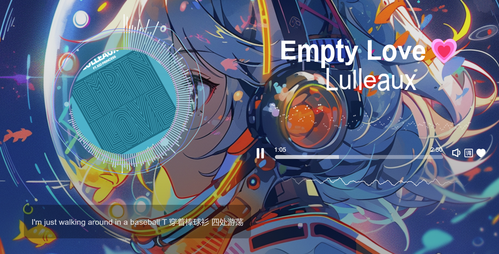

# Debug-Web-Single-MusicPlayer
一个网页的现代美观带音频可视化的单曲播放器，支持加密音频播放(前提是写了对应的解密代码，demo里是以xor加密为例子，音频是加密后的)

## 启动：
```
python -m http.server
```

## 演示地址
> 我们提供了四首歌演示。

[提拉米苏](https://nwdxlgzs.github.io/Debug-Web-Single-MusicPlayer/index.html?diff_demo=提拉米苏)

[Empty Love](https://nwdxlgzs.github.io/Debug-Web-Single-MusicPlayer/index.html?diff_demo=EmptyLove)

[I Really Like You](https://nwdxlgzs.github.io/Debug-Web-Single-MusicPlayer/index.html?diff_demo=IReallyLikeYou)

[Heartbeat](https://nwdxlgzs.github.io/Debug-Web-Single-MusicPlayer/index.html?diff_demo=Heartbeat)

## 截图


## Pull requests说明
> 这个播放器计划只支持播放单曲，相关API也是奔着单曲做的（以及带解密预留的懒加载设计等），如果对这些有修改想法，请等这个项目完成后，开的新的基于此项目的后续版本进行Pr。

## 更换播放器内容
> 只需要修改`attach.json`内容即可，播放器本身是空壳，通过被动附着`attach.json`挂载的数据实现播放。

> 必填参数只有一个：`musicURL`。
```json
{
    "musicURL":"./resources/Lulleaux-Empty Love.mp3"
}
```
> 下面是attach.json缺省参数时匹配的默认设置
```json
 {
    "backgroundImage":"./images/background.png",
    "coverImage":"./images/cover.png",
    "songTitle":"Unkown Song",
    "artistName":"Unkown Artist",
    "mediaType":"audio/mpeg",
    "backgroundType":"gradient",
    "BGfilterBlurPx":5,
    "lrcFile":null,
    "lrcExistLike":"hide",
    "animationSTAN":"circle",
    "BGMusicScale":0,
    "BGGradientConfig":{
        "colorSource":"cover",
        "alphas":[
            0.1,
            0.5
        ],
        "ranges":[
            25,
            80
        ],
        "coverThemeIndex":0
    },
    "like":true,
    "waveLike":"line|circle",
    "coverScale":true,
    "coverRotate":true,
    "withBubbles":true,
    "waveCircleConfig":{
        "lineColors":[
            "#90E3F5",
            "#5C8AF4",
            "#BEABF0",
            "#E1A2E1"
        ],
        "fillColor":"cover",
        "fillAlphaDeep":0.8,
        "coverThemeIndex":0
    },
    "waveLineConfig":{
        "barWidth":4,
        "gapWidth":3,
        "flip":false,
        "color":"cover",
        "coverThemeIndex":1
    },
    "bubblesColor":"white"
}
```
> 参数说明：

|              参数名              |                                             说明                                             |
| :------------------------------: | :------------------------------------------------------------------------------------------: |
|         backgroundImage          |                                           背景图片                                           |
|            coverImage            |                             封面图片（主题色影响周边半透明波浪）                             |
|            songTitle             |                                           歌曲标题                                           |
|            artistName            |                                          艺术家名称                                          |
|             musicURL             |                                         音频文件路径                                         |
|            mediaType             |                               音频文件类型（一般填audio/mpeg）                               |
|             lrcFile              |                                  歌词文件路径（只支持lrc）                                   |
|           lrcExistLike           |                 歌词存在风格（中心center,隐藏hide同时隐藏歌词按钮,靠左left）                 |
|          animationSTAN           |  歌曲标题&艺术家名称文字动画风格（圆周平移circle,无动画none,变长变短skew,左右倾斜stretch）   |
|          BGfilterBlurPx          |                                   背景图片进行模糊时的px值                                   |
|          backgroundType          |                                      背景的额外配置类型                                      |
|           BGMusicScale           |                     背景跟随音频缩放，0为不缩放，如果缩放则推荐参数0.05                      |
|         BGGradientConfig         |                                backgroundType为gradient时启用                                |
|   BGGradientConfig.colorSource   |         颜色依据，cover时使用封面主题色，可以使用形如['rgb(0,0,0)','white']指定颜色          |
|     BGGradientConfig.alphas      |                           colorSource为cover时启用，控制始末透明度                           |
|     BGGradientConfig.ranges      |                       colorSource为cover时启用，控制始末透明度范围位置                       |
| BGGradientConfig.coverThemeIndex |                        colorSource为cover时启用，封面主题色的编号索引                        |
|               like               |                                     播放器显示歌曲为喜欢                                     |
|             waveLike             | 封面周围频谱波纹风格，line与mirror-line互斥，circle可以并存，'line'和'mirror-line'不可以并存 |
|            coverScale            |                                      封面是否随音乐缩放                                      |
|           coverRotate            |                                        封面是否随旋转                                        |
|           withBubbles            |                         封面周围是否有气泡（气泡数量取决于当前频谱）                         |
|         waveCircleConfig         |                                   waveLike包含circle时启用                                   |
|   waveCircleConfig.lineColors    |                            外围线颜色，设置的颜色数量也会影响圈数                            |
|    waveCircleConfig.fillColor    |            填充颜色，cover时使用封面主题色，可以使用形如[255,255,255]指定rgb颜色             |
|  waveCircleConfig.fillAlphaDeep  |          填充颜色的共享透明度，如4个圈时fillAlphaDeep=0.8指每个圈填充色透明度为0.2           |
| waveCircleConfig.coverThemeIndex |                         fillColor为cover时启用，封面主题色的编号索引                         |
|          waveLineConfig          |                            waveLike包含line或者mirror-line时启用                             |
|     waveLineConfig.barWidth      |                                           条宽像素                                           |
|     waveLineConfig.gapWidth      |                                          条间隔像素                                          |
|       waveLineConfig.flip        |                                频谱位置是否扭转180度水平翻转                                 |
|       waveLineConfig.color       |   条色，cover时使用封面主题色，rainbow时按角度以hsl生成彩色，可以使用形如rgb(0,0,0)的颜色    |
|  waveLineConfig.coverThemeIndex  |                           color为cover时启用，封面主题色的编号索引                           |
|           bubblesColor           |                          气泡小球颜色，可以使用形如rgb(0,0,0)的颜色                          |

## attach.json辅助填写工具
不清楚attach还会开放多少参数，所以我们简单借助CodeMirror辅助注释提示做了这个工具，[点我即可跳转](https://nwdxlgzs.github.io/Debug-Web-Single-MusicPlayer/attachConfig/attachConfig.html)。

## Contributors
| 贡献者                                                       | 贡献内容        |
| ------------------------------------------------------------ | --------------- |
|          | 项目实际维护    |
|          | BUG修复、UI修正 |
|  | 项目重构        |
